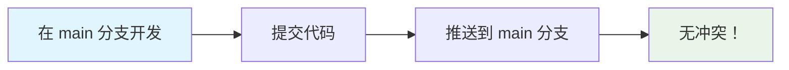
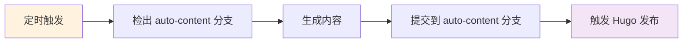

# 分支分离使用指南

## 🎯 概述

本项目采用分支分离策略，完全解决代码开发和自动内容生成的冲突问题。

### 分支结构

```
📦 仓库
├── 🔧 main 分支 (代码开发)
│   ├── scripts/          # 脚本文件
│   ├── .github/          # 工作流配置
│   ├── requirements.txt  # 依赖配置
│   └── *.md             # 文档文件
│
└── 📄 auto-content 分支 (自动内容)
    ├── scripts/          # 同步的脚本文件
    ├── .github/          # 同步的工作流配置
    ├── data/             # 自动生成的内容
    └── *.md             # 同步的文档文件
```

## 🚀 快速开始

### 1. 初始化设置

```bash
# 给脚本执行权限
chmod +x scripts/branch_management.sh

# 初始化分支分离
./scripts/branch_management.sh setup
```

### 2. 日常开发流程

```bash
# 确保在 main 分支
git checkout main

# 进行代码开发
# 编辑文件...

# 提交代码（不会有冲突！）
git add .
git commit -m "Your changes"
git push origin main
```

### 3. 查看生成的内容

```bash
# 切换到内容分支
git checkout auto-content

# 查看生成的文件
ls -la data/

# 回到开发分支
git checkout main
```

## 📋 详细工作流程

### 代码开发流程



### 内容生成流程



## 🛠️ 管理命令

### 基本命令

```bash
# 查看分支状态
./scripts/branch_management.sh status

# 同步代码到内容分支
./scripts/branch_management.sh sync

# 切换分支
./scripts/branch_management.sh switch

# 查看帮助
./scripts/branch_management.sh help
```

### 状态检查

```bash
# 查看当前分支
git branch --show-current

# 查看所有分支
git branch -a

# 查看分支差异
git log main..auto-content --oneline
```

## 📊 分支对比

| 特性 | main 分支 | auto-content 分支 |
|------|-----------|-------------------|
| **用途** | 代码开发 | 内容生成 |
| **维护者** | 开发者手动 | GitHub Actions 自动 |
| **内容** | 脚本、配置、文档 | 脚本 + 生成的内容 |
| **推送频率** | 按需推送 | 每日自动 |
| **冲突风险** | 无 | 无 |

## 🔄 同步机制

### 代码同步

当您在 main 分支更新代码时，需要同步到 auto-content 分支：

```bash
# 自动同步（推荐）
./scripts/branch_management.sh sync

# 手动同步
git checkout auto-content
git checkout main -- scripts/
git checkout main -- .github/
git add .
git commit -m "Sync code from main"
git push origin auto-content
git checkout main
```

### 内容获取

如果需要查看或使用生成的内容：

```bash
# 方法1：切换分支查看
git checkout auto-content
ls data/
git checkout main

# 方法2：复制特定文件
git show auto-content:data/producthunt-daily-2025-06-15.md > temp.md

# 方法3：合并特定文件
git checkout auto-content -- data/producthunt-daily-2025-06-15.md
```

## 🎯 最佳实践

### 1. 开发规范

- ✅ **始终在 main 分支开发代码**
- ✅ **定期同步代码到 auto-content 分支**
- ✅ **不要在 auto-content 分支手动修改代码**
- ✅ **使用管理脚本进行分支操作**

### 2. 文件管理

```bash
# 代码文件（在 main 分支维护）
scripts/
.github/
requirements.txt
*.py
*.md (文档)

# 内容文件（在 auto-content 分支生成）
data/
```

### 3. 冲突处理

由于分支分离，理论上不会有冲突。如果遇到问题：

```bash
# 重置分支设置
./scripts/branch_management.sh clean
./scripts/branch_management.sh setup
```

## 🔧 故障排除

### 常见问题

**Q: auto-content 分支不存在？**
```bash
A: 运行 ./scripts/branch_management.sh setup
```

**Q: 代码更改没有同步到 auto-content？**
```bash
A: 运行 ./scripts/branch_management.sh sync
```

**Q: GitHub Actions 失败？**
```bash
A: 检查 auto-content 分支是否存在，确保工作流配置正确
```

**Q: 想要回到单分支模式？**
```bash
A: 运行 ./scripts/branch_management.sh clean
```

### 紧急恢复

如果分支设置出现问题：

```bash
# 1. 备份当前工作
git stash

# 2. 重置分支设置
./scripts/branch_management.sh clean
./scripts/branch_management.sh setup

# 3. 恢复工作
git stash pop
```

## 📈 优势总结

### ✅ 解决的问题

1. **完全消除推送冲突** - 代码和内容分离
2. **清晰的职责分工** - 开发者管理代码，Actions 管理内容
3. **简化工作流程** - 不需要复杂的同步操作
4. **保持历史清洁** - 两个分支各自维护清晰的提交历史

### 🎯 适用场景

- ✅ 有自动化内容生成的项目
- ✅ 多人协作开发
- ✅ 需要保持代码和内容分离
- ✅ 希望避免 Git 冲突的团队

---

**🎉 现在您可以专注于代码开发，不再担心推送冲突！**
