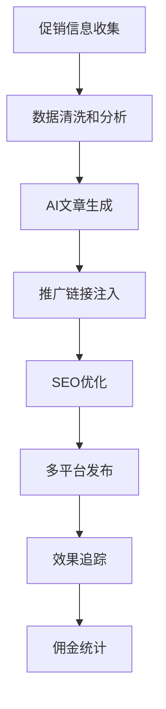

# AI驱动的VPS推广文章生成方案

## 概述

本方案提供了一个完整的AI驱动系统，从VPS促销信息收集到推广文章生成，再到发布和佣金追踪的全流程自动化解决方案。

## 业务流程



## 核心组件

### 1. 促销信息收集和预处理

#### 数据收集增强
```python
class VPSPromotionCollector:
    def __init__(self):
        self.affiliate_programs = {
            'bandwagonhost': {
                'affiliate_id': 'your_bwh_id',
                'commission_rate': '5.88%',
                'cookie_duration': '60天',
                'base_url': 'https://bandwagonhost.com/aff.php?aff=your_id&pid='
            },
            'racknerd': {
                'affiliate_id': 'your_racknerd_id',
                'commission_rate': '20%',
                'cookie_duration': '30天',
                'base_url': 'https://my.racknerd.com/aff.php?aff=your_id&pid='
            },
            'hostdare': {
                'affiliate_id': 'your_hostdare_id',
                'commission_rate': '25%',
                'cookie_duration': '45天',
                'base_url': 'https://bill.hostdare.com/aff.php?aff=your_id&pid='
            }
        }

    def enrich_promotion_data(self, promotion):
        """丰富促销数据，添加推广信息"""
        provider = promotion.get('provider', '').lower()

        # 添加联盟计划信息
        if provider in self.affiliate_programs:
            affiliate_info = self.affiliate_programs[provider]
            promotion.update({
                'affiliate_id': affiliate_info['affiliate_id'],
                'commission_rate': affiliate_info['commission_rate'],
                'affiliate_url_template': affiliate_info['base_url'],
                'has_affiliate': True
            })
        else:
            promotion['has_affiliate'] = False

        # 提取关键促销信息
        promotion.update({
            'discount_percentage': self.extract_discount(promotion),
            'price_range': self.extract_price_range(promotion),
            'urgency_level': self.calculate_urgency(promotion),
            'target_audience': self.identify_target_audience(promotion)
        })

        return promotion

    def extract_discount(self, promotion):
        """提取折扣信息"""
        text = f"{promotion.get('title', '')} {promotion.get('summary', '')}"

        # 查找折扣百分比
        import re
        discount_match = re.search(r'(\d+)%\s*off', text.lower())
        if discount_match:
            return int(discount_match.group(1))

        # 查找其他折扣表达
        if 'half price' in text.lower():
            return 50
        elif 'free' in text.lower():
            return 100

        return 0

    def extract_price_range(self, promotion):
        """提取价格范围"""
        text = f"{promotion.get('title', '')} {promotion.get('summary', '')}"

        import re
        prices = re.findall(r'\$(\d+(?:\.\d{2})?)', text)
        prices = [float(p) for p in prices]

        if prices:
            return {
                'min_price': min(prices),
                'max_price': max(prices),
                'avg_price': sum(prices) / len(prices)
            }

        return {'min_price': None, 'max_price': None, 'avg_price': None}

    def calculate_urgency(self, promotion):
        """计算紧急程度"""
        text = f"{promotion.get('title', '')} {promotion.get('summary', '')}".lower()

        urgency_keywords = {
            'flash sale': 10,
            'limited time': 9,
            '24 hours': 10,
            '48 hours': 8,
            'today only': 10,
            'ends soon': 7,
            'black friday': 9,
            'cyber monday': 9
        }

        max_urgency = 0
        for keyword, score in urgency_keywords.items():
            if keyword in text:
                max_urgency = max(max_urgency, score)

        return max_urgency

    def identify_target_audience(self, promotion):
        """识别目标受众"""
        text = f"{promotion.get('title', '')} {promotion.get('summary', '')}".lower()

        audiences = []

        if any(keyword in text for keyword in ['developer', 'coding', 'programming']):
            audiences.append('developers')

        if any(keyword in text for keyword in ['business', 'enterprise', 'company']):
            audiences.append('businesses')

        if any(keyword in text for keyword in ['beginner', 'starter', 'basic']):
            audiences.append('beginners')

        if any(keyword in text for keyword in ['game', 'gaming', 'minecraft']):
            audiences.append('gamers')

        if any(keyword in text for keyword in ['blog', 'website', 'wordpress']):
            audiences.append('bloggers')

        return audiences if audiences else ['general']
```

### 2. AI文章生成引擎

#### 文章模板系统
```python
class VPSArticleGenerator:
    def __init__(self, ai_provider='openai'):
        self.ai_provider = ai_provider
        self.article_templates = {
            'review': {
                'title_template': "{provider} {promotion_type}深度评测：{discount}折扣值得入手吗？",
                'structure': ['introduction', 'provider_overview', 'promotion_details',
                            'performance_analysis', 'pricing_comparison', 'pros_cons',
                            'target_audience', 'conclusion', 'faq'],
                'word_count': 2000,
                'tone': 'professional_review'
            },
            'deal_alert': {
                'title_template': "🔥 {provider} {promotion_type}限时优惠：{discount}折扣，仅限{urgency}！",
                'structure': ['urgent_intro', 'deal_highlights', 'quick_specs',
                            'why_choose', 'how_to_buy', 'alternatives', 'conclusion'],
                'word_count': 1200,
                'tone': 'urgent_promotional'
            },
            'comparison': {
                'title_template': "{provider} vs 竞品对比：{promotion_type}哪家更值得买？",
                'structure': ['introduction', 'comparison_table', 'detailed_analysis',
                            'use_case_scenarios', 'price_performance', 'recommendation'],
                'word_count': 1800,
                'tone': 'analytical_comparison'
            },
            'tutorial': {
                'title_template': "{provider} VPS购买指南：{promotion_type}新手完整教程",
                'structure': ['introduction', 'provider_intro', 'promotion_explanation',
                            'step_by_step_guide', 'configuration_tips', 'troubleshooting',
                            'optimization_tips', 'conclusion'],
                'word_count': 2500,
                'tone': 'educational_friendly'
            }
        }

    def select_article_type(self, promotion):
        """根据促销信息选择文章类型"""
        urgency = promotion.get('urgency_level', 0)
        discount = promotion.get('discount_percentage', 0)
        target_audience = promotion.get('target_audience', ['general'])

        # 高紧急度 -> 促销提醒文章
        if urgency >= 8:
            return 'deal_alert'

        # 高折扣 -> 评测文章
        elif discount >= 50:
            return 'review'

        # 新手用户 -> 教程文章
        elif 'beginners' in target_audience:
            return 'tutorial'

        # 默认对比文章
        else:
            return 'comparison'

    def generate_article_outline(self, promotion, article_type):
        """生成文章大纲"""
        template = self.article_templates[article_type]

        outline = {
            'title': self.generate_title(promotion, template['title_template']),
            'meta_description': self.generate_meta_description(promotion),
            'sections': [],
            'word_count_target': template['word_count'],
            'tone': template['tone'],
            'keywords': self.extract_seo_keywords(promotion)
        }

        # 生成各个章节
        for section in template['structure']:
            section_content = self.generate_section_outline(promotion, section, article_type)
            outline['sections'].append(section_content)

        return outline

    def generate_title(self, promotion, template):
        """生成文章标题"""
        provider = promotion.get('provider', 'VPS服务商')
        discount = promotion.get('discount_percentage', 0)
        urgency_map = {
            10: '今日',
            9: '限时',
            8: '48小时',
            7: '本周',
            0: '最新'
        }
        urgency = urgency_map.get(promotion.get('urgency_level', 0), '最新')

        promotion_type_map = {
            'black_friday': '黑五大促',
            'cyber_monday': '网络星期一',
            'christmas': '圣诞特惠',
            'flash_sale': '闪购',
            'regular': 'VPS优惠'
        }

        promotion_type = promotion_type_map.get(
            promotion.get('category', 'regular'),
            'VPS优惠'
        )

        return template.format(
            provider=provider.title(),
            promotion_type=promotion_type,
            discount=f"{discount}%" if discount > 0 else "超值",
            urgency=urgency
        )

    def generate_meta_description(self, promotion):
        """生成SEO描述"""
        provider = promotion.get('provider', 'VPS服务商')
        discount = promotion.get('discount_percentage', 0)
        price = promotion.get('price_range', {}).get('min_price')

        if discount > 0 and price:
            return f"{provider} VPS {discount}%折扣优惠，最低${price}/月起。高性能云服务器，适合开发者和企业用户。立即查看详情和购买链接。"
        elif discount > 0:
            return f"{provider} VPS {discount}%折扣促销活动，高性能云服务器优惠价格。详细评测、配置对比和购买指南。"
        else:
            return f"{provider} VPS最新优惠活动，高性能云服务器促销信息。详细评测、价格对比和购买建议。"

    def extract_seo_keywords(self, promotion):
        """提取SEO关键词"""
        provider = promotion.get('provider', '').lower()
        base_keywords = [
            f"{provider} vps",
            f"{provider} 优惠",
            f"{provider} 促销",
            "vps推荐",
            "云服务器",
            "虚拟主机"
        ]

        # 根据促销类型添加关键词
        category = promotion.get('category', '')
        if 'black_friday' in category:
            base_keywords.extend(['黑五vps', '黑色星期五优惠'])
        elif 'flash_sale' in category:
            base_keywords.extend(['vps闪购', '限时优惠'])

        # 根据目标受众添加关键词
        audiences = promotion.get('target_audience', [])
        if 'developers' in audiences:
            base_keywords.extend(['开发者vps', '程序员服务器'])
        elif 'beginners' in audiences:
            base_keywords.extend(['新手vps', 'vps入门'])

        return base_keywords[:10]  # 限制关键词数量
```

### 3. AI内容生成

#### OpenAI集成
```python
import openai
from datetime import datetime

class AIContentGenerator:
    def __init__(self, api_key, model='gpt-4'):
        self.client = openai.OpenAI(api_key=api_key)
        self.model = model

    def generate_section_content(self, promotion, section_outline, context):
        """生成章节内容"""

        system_prompt = f"""
你是一位专业的VPS和云服务器评测专家，擅长写作技术评测和购买指南。

写作要求：
1. 内容专业、客观、有价值
2. 语言通俗易懂，适合技术和非技术用户
3. 包含具体的技术细节和实用建议
4. 自然融入推广信息，不要过于商业化
5. 符合SEO最佳实践

当前任务：为{promotion.get('provider', 'VPS服务商')}的促销活动写作{section_outline['title']}章节
"""

        user_prompt = f"""
促销信息：
- 服务商：{promotion.get('provider', '未知')}
- 折扣：{promotion.get('discount_percentage', 0)}%
- 价格范围：${promotion.get('price_range', {}).get('min_price', 'N/A')} - ${promotion.get('price_range', {}).get('max_price', 'N/A')}
- 紧急程度：{promotion.get('urgency_level', 0)}/10
- 目标受众：{', '.join(promotion.get('target_audience', ['通用']))}

章节要求：
- 标题：{section_outline['title']}
- 字数：{section_outline['word_count']}字
- 要点：{', '.join(section_outline['key_points'])}

请生成这个章节的内容，要求：
1. 内容丰富、有价值
2. 包含具体的技术参数和对比
3. 提供实用的建议和技巧
4. 语言自然流畅
5. 适当包含相关关键词
"""

        try:
            response = self.client.chat.completions.create(
                model=self.model,
                messages=[
                    {"role": "system", "content": system_prompt},
                    {"role": "user", "content": user_prompt}
                ],
                temperature=0.7,
                max_tokens=1500
            )

            return response.choices[0].message.content

        except Exception as e:
            print(f"AI生成内容失败: {e}")
            return self.generate_fallback_content(section_outline)

    def generate_fallback_content(self, section_outline):
        """生成备用内容"""
        return f"""
## {section_outline['title']}

{section_outline.get('description', '本章节将详细介绍相关内容。')}

### 主要要点

{chr(10).join(f"- {point}" for point in section_outline.get('key_points', ['待补充内容']))}

*注：本章节内容正在生成中，请稍后查看完整版本。*
"""

    def generate_complete_article(self, promotion, outline):
        """生成完整文章"""
        article_parts = []

        # 文章头部
        article_parts.append(f"# {outline['title']}\n")
        article_parts.append(f"> 发布时间：{datetime.now().strftime('%Y年%m月%d日')}\n")
        article_parts.append(f"> 关键词：{', '.join(outline['keywords'])}\n\n")

        # 生成各个章节
        for section in outline['sections']:
            print(f"正在生成章节：{section['title']}")

            content = self.generate_section_content(promotion, section, outline)
            article_parts.append(f"## {section['title']}\n")
            article_parts.append(f"{content}\n\n")

        # 添加推广链接部分
        affiliate_section = self.generate_affiliate_section(promotion)
        article_parts.append(affiliate_section)

        return ''.join(article_parts)

    def generate_affiliate_section(self, promotion):
        """生成推广链接部分"""
        if not promotion.get('has_affiliate'):
            return ""

        provider = promotion.get('provider', 'VPS服务商')
        commission_rate = promotion.get('commission_rate', '未知')

        return f"""
## 🛒 购买链接和优惠码

### 官方购买链接

**[👉 点击这里访问{provider}官网购买]({promotion.get('affiliate_url_template', '#')})**

### 购买说明

- ✅ 通过上述链接购买可享受最优惠价格
- ✅ 支持30天退款保证
- ✅ 24/7技术支持
- ✅ 佣金比例：{commission_rate}（支持本站运营）

### 注意事项

1. 请确认促销活动仍在有效期内
2. 部分优惠可能需要使用特定优惠码
3. 建议在购买前仔细阅读服务条款
4. 如有问题可以联系客服或在评论区留言

---

*免责声明：本文包含推广链接，通过这些链接购买我们可能获得佣金，但这不会影响您的购买价格。我们只推荐我们认为有价值的产品和服务。*
"""
```

### 4. 推广链接管理

#### 联盟链接生成器
```python
class AffiliateLinksManager:
    def __init__(self):
        self.affiliate_programs = {
            'bandwagonhost': {
                'base_url': 'https://bandwagonhost.com/aff.php',
                'params': {'aff': 'your_bwh_id'},
                'product_param': 'pid'
            },
            'racknerd': {
                'base_url': 'https://my.racknerd.com/aff.php',
                'params': {'aff': 'your_racknerd_id'},
                'product_param': 'pid'
            },
            'digitalocean': {
                'base_url': 'https://m.do.co/c/your_do_referral',
                'params': {},
                'product_param': None
            }
        }

    def generate_affiliate_url(self, provider, product_id=None, campaign=None):
        """生成联盟链接"""
        if provider not in self.affiliate_programs:
            return None

        config = self.affiliate_programs[provider]
        params = config['params'].copy()

        if product_id and config['product_param']:
            params[config['product_param']] = product_id

        if campaign:
            params['campaign'] = campaign

        # 添加追踪参数
        params['utm_source'] = 'your_website'
        params['utm_medium'] = 'article'
        params['utm_campaign'] = f'{provider}_{campaign or "promotion"}'

        # 构建URL
        if params:
            param_string = '&'.join([f'{k}={v}' for k, v in params.items()])
            return f"{config['base_url']}?{param_string}"
        else:
            return config['base_url']

    def track_click(self, provider, article_id, user_ip=None):
        """追踪点击"""
        # 这里可以集成Google Analytics或其他追踪系统
        click_data = {
            'provider': provider,
            'article_id': article_id,
            'timestamp': datetime.now().isoformat(),
            'user_ip': user_ip,
            'referrer': 'article'
        }

        # 保存到数据库或发送到分析系统
        self.save_click_data(click_data)

    def save_click_data(self, click_data):
        """保存点击数据"""
        # 实现数据保存逻辑
        pass
```

### 5. SEO优化和发布

#### SEO优化器
```python
class SEOOptimizer:
    def __init__(self):
        self.seo_rules = {
            'title_length': (30, 60),
            'meta_description_length': (120, 160),
            'keyword_density': (1, 3),  # 百分比
            'heading_structure': True,
            'internal_links': 3,
            'external_links': 2
        }

    def optimize_article(self, article_content, target_keywords):
        """优化文章SEO"""
        optimized_content = article_content

        # 1. 优化标题结构
        optimized_content = self.optimize_headings(optimized_content)

        # 2. 添加内部链接
        optimized_content = self.add_internal_links(optimized_content)

        # 3. 优化关键词密度
        optimized_content = self.optimize_keyword_density(optimized_content, target_keywords)

        # 4. 添加结构化数据
        structured_data = self.generate_structured_data(optimized_content)

        # 5. 生成社交媒体标签
        social_tags = self.generate_social_tags(optimized_content)

        return {
            'content': optimized_content,
            'structured_data': structured_data,
            'social_tags': social_tags,
            'seo_score': self.calculate_seo_score(optimized_content, target_keywords)
        }

    def optimize_headings(self, content):
        """优化标题结构"""
        lines = content.split('\n')
        optimized_lines = []

        h2_count = 0
        h3_count = 0

        for line in lines:
            if line.startswith('## '):
                h2_count += 1
                # 确保H2标题包含关键词
                optimized_lines.append(line)
            elif line.startswith('### '):
                h3_count += 1
                optimized_lines.append(line)
            else:
                optimized_lines.append(line)

        return '\n'.join(optimized_lines)

    def add_internal_links(self, content):
        """添加内部链接"""
        # 相关文章链接模板
        related_articles = [
            "[VPS性能测试指南](/vps-performance-testing/)",
            "[云服务器安全配置](/vps-security-guide/)",
            "[VPS价格对比分析](/vps-price-comparison/)",
            "[新手VPS购买指南](/vps-buying-guide/)"
        ]

        # 在文章末尾添加相关文章
        internal_links_section = f"""
## 相关推荐

{chr(10).join(f"- {link}" for link in related_articles[:3])}
"""

        return content + internal_links_section

    def optimize_keyword_density(self, content, keywords):
        """优化关键词密度"""
        # 简单的关键词密度优化
        # 在实际应用中，这里应该有更复杂的NLP处理
        return content

    def generate_structured_data(self, content):
        """生成结构化数据"""
        # 提取文章信息
        lines = content.split('\n')
        title = lines[0].replace('# ', '') if lines else "VPS促销文章"

        structured_data = {
            "@context": "https://schema.org",
            "@type": "Article",
            "headline": title,
            "author": {
                "@type": "Organization",
                "name": "VPS评测网"
            },
            "publisher": {
                "@type": "Organization",
                "name": "VPS评测网",
                "logo": {
                    "@type": "ImageObject",
                    "url": "https://yoursite.com/logo.png"
                }
            },
            "datePublished": datetime.now().isoformat(),
            "dateModified": datetime.now().isoformat(),
            "description": "专业的VPS促销信息和购买指南",
            "mainEntityOfPage": {
                "@type": "WebPage",
                "@id": "https://yoursite.com/current-article"
            }
        }

        return structured_data

    def generate_social_tags(self, content):
        """生成社交媒体标签"""
        lines = content.split('\n')
        title = lines[0].replace('# ', '') if lines else "VPS促销文章"

        # 提取描述
        description = "专业的VPS促销信息和购买指南，帮助您选择最适合的云服务器。"

        social_tags = {
            'og_title': title,
            'og_description': description,
            'og_type': 'article',
            'og_url': 'https://yoursite.com/current-article',
            'og_image': 'https://yoursite.com/article-image.jpg',
            'twitter_card': 'summary_large_image',
            'twitter_title': title,
            'twitter_description': description,
            'twitter_image': 'https://yoursite.com/article-image.jpg'
        }

        return social_tags

    def calculate_seo_score(self, content, keywords):
        """计算SEO评分"""
        score = 0

        # 检查标题长度
        lines = content.split('\n')
        title = lines[0].replace('# ', '') if lines else ""
        if 30 <= len(title) <= 60:
            score += 20

        # 检查关键词出现
        content_lower = content.lower()
        for keyword in keywords:
            if keyword.lower() in content_lower:
                score += 10

        # 检查标题结构
        h2_count = content.count('## ')
        h3_count = content.count('### ')
        if h2_count >= 3 and h3_count >= 2:
            score += 20

        # 检查内容长度
        word_count = len(content.split())
        if word_count >= 1500:
            score += 20

        # 检查链接
        if '[' in content and '](' in content:
            score += 10

        return min(score, 100)

#### 多平台发布器
class MultiPlatformPublisher:
    def __init__(self):
        self.platforms = {
            'wordpress': WordPressPublisher(),
            'hugo': HugoPublisher(),
            'medium': MediumPublisher(),
            'zhihu': ZhihuPublisher(),
            'csdn': CSDNPublisher()
        }

    def publish_article(self, article_data, platforms=['wordpress']):
        """发布文章到多个平台"""
        results = {}

        for platform in platforms:
            if platform in self.platforms:
                try:
                    publisher = self.platforms[platform]
                    result = publisher.publish(article_data)
                    results[platform] = {
                        'success': True,
                        'url': result.get('url'),
                        'id': result.get('id')
                    }
                except Exception as e:
                    results[platform] = {
                        'success': False,
                        'error': str(e)
                    }

        return results

class WordPressPublisher:
    def __init__(self, site_url, username, password):
        self.site_url = site_url
        self.username = username
        self.password = password

    def publish(self, article_data):
        """发布到WordPress"""
        import requests
        from requests.auth import HTTPBasicAuth

        # WordPress REST API
        api_url = f"{self.site_url}/wp-json/wp/v2/posts"

        post_data = {
            'title': article_data['title'],
            'content': article_data['content'],
            'status': 'publish',
            'categories': article_data.get('categories', []),
            'tags': article_data.get('tags', []),
            'meta': {
                'description': article_data.get('meta_description', ''),
                'keywords': ','.join(article_data.get('keywords', []))
            }
        }

        response = requests.post(
            api_url,
            json=post_data,
            auth=HTTPBasicAuth(self.username, self.password)
        )

        if response.status_code == 201:
            post_info = response.json()
            return {
                'url': post_info['link'],
                'id': post_info['id']
            }
        else:
            raise Exception(f"WordPress发布失败: {response.text}")

class HugoPublisher:
    def __init__(self, content_dir):
        self.content_dir = content_dir

    def publish(self, article_data):
        """发布到Hugo"""
        from pathlib import Path
        import yaml

        # 生成文件名
        title_slug = article_data['title'].lower().replace(' ', '-').replace('：', '-')
        filename = f"{datetime.now().strftime('%Y-%m-%d')}-{title_slug}.md"
        file_path = Path(self.content_dir) / 'posts' / filename

        # 生成Front Matter
        front_matter = {
            'title': article_data['title'],
            'date': datetime.now().isoformat(),
            'description': article_data.get('meta_description', ''),
            'categories': article_data.get('categories', []),
            'tags': article_data.get('tags', []),
            'keywords': article_data.get('keywords', []),
            'draft': False
        }

        # 写入文件
        with open(file_path, 'w', encoding='utf-8') as f:
            f.write('---\n')
            yaml.dump(front_matter, f, default_flow_style=False, allow_unicode=True)
            f.write('---\n\n')
            f.write(article_data['content'])

        return {
            'url': f"/posts/{filename.replace('.md', '/')}",
            'id': filename
        }
```

### 6. 效果追踪和分析

#### 数据分析器
```python
class PerformanceAnalyzer:
    def __init__(self, db_connection):
        self.db = db_connection

    def track_article_performance(self, article_id):
        """追踪文章表现"""
        metrics = {
            'views': self.get_page_views(article_id),
            'clicks': self.get_affiliate_clicks(article_id),
            'conversions': self.get_conversions(article_id),
            'revenue': self.get_revenue(article_id),
            'ctr': 0,  # 点击率
            'conversion_rate': 0,  # 转化率
            'rpm': 0   # 每千次浏览收入
        }

        # 计算衍生指标
        if metrics['views'] > 0:
            metrics['ctr'] = (metrics['clicks'] / metrics['views']) * 100
            metrics['rpm'] = (metrics['revenue'] / metrics['views']) * 1000

        if metrics['clicks'] > 0:
            metrics['conversion_rate'] = (metrics['conversions'] / metrics['clicks']) * 100

        return metrics

    def get_page_views(self, article_id):
        """获取页面浏览量"""
        # 集成Google Analytics或其他分析工具
        return 0

    def get_affiliate_clicks(self, article_id):
        """获取联盟链接点击数"""
        # 从数据库查询点击数据
        return 0

    def get_conversions(self, article_id):
        """获取转化数"""
        # 从联盟平台API获取转化数据
        return 0

    def get_revenue(self, article_id):
        """获取收入"""
        # 从联盟平台API获取收入数据
        return 0.0

    def generate_performance_report(self, date_range):
        """生成表现报告"""
        report = {
            'period': date_range,
            'total_articles': 0,
            'total_views': 0,
            'total_clicks': 0,
            'total_revenue': 0,
            'top_articles': [],
            'top_providers': [],
            'recommendations': []
        }

        # 查询数据并生成报告
        # ...

        return report

#### 自动化优化建议
class ContentOptimizer:
    def __init__(self, analyzer):
        self.analyzer = analyzer

    def analyze_content_performance(self, article_id):
        """分析内容表现"""
        metrics = self.analyzer.track_article_performance(article_id)

        suggestions = []

        # 基于CTR给出建议
        if metrics['ctr'] < 2:
            suggestions.append({
                'type': 'ctr_improvement',
                'message': 'CTR较低，建议优化标题和CTA按钮',
                'priority': 'high'
            })

        # 基于转化率给出建议
        if metrics['conversion_rate'] < 1:
            suggestions.append({
                'type': 'conversion_improvement',
                'message': '转化率较低，建议优化推广链接位置和文案',
                'priority': 'medium'
            })

        # 基于浏览量给出建议
        if metrics['views'] < 100:
            suggestions.append({
                'type': 'traffic_improvement',
                'message': '浏览量较低，建议优化SEO和社交媒体推广',
                'priority': 'high'
            })

        return {
            'metrics': metrics,
            'suggestions': suggestions,
            'overall_score': self.calculate_overall_score(metrics)
        }

    def calculate_overall_score(self, metrics):
        """计算综合评分"""
        score = 0

        # CTR评分 (0-30分)
        if metrics['ctr'] >= 5:
            score += 30
        elif metrics['ctr'] >= 3:
            score += 20
        elif metrics['ctr'] >= 1:
            score += 10

        # 转化率评分 (0-30分)
        if metrics['conversion_rate'] >= 3:
            score += 30
        elif metrics['conversion_rate'] >= 2:
            score += 20
        elif metrics['conversion_rate'] >= 1:
            score += 10

        # RPM评分 (0-40分)
        if metrics['rpm'] >= 10:
            score += 40
        elif metrics['rpm'] >= 5:
            score += 30
        elif metrics['rpm'] >= 1:
            score += 20
        elif metrics['rpm'] >= 0.5:
            score += 10

        return score
```

### 7. GitHub Actions集成

#### 完整的自动化工作流
```python
# .github/workflows/ai-content-generator.yml
name: AI VPS Content Generator

on:
  schedule:
    - cron: '0 */6 * * *'  # 每6小时运行一次
  workflow_dispatch:
    inputs:
      mode:
        description: '生成模式'
        required: true
        default: 'auto'
        type: choice
        options:
        - auto
        - black_friday
        - manual

      provider:
        description: '指定服务商（可选）'
        required: false
        default: ''

jobs:
  generate-content:
    runs-on: ubuntu-latest

    steps:
    - name: Checkout repository
      uses: actions/checkout@v4

    - name: Set up Python
      uses: actions/setup-python@v4
      with:
        python-version: '3.9'

    - name: Install dependencies
      run: |
        pip install -r requirements.txt

    - name: Collect VPS promotions
      run: |
        python scripts/vps_promotion_collector.py \
          --mode ${{ github.event.inputs.mode || 'auto' }} \
          --output-dir data/promotions

    - name: Generate AI articles
      run: |
        python scripts/ai_content_generator.py \
          --promotions-dir data/promotions \
          --output-dir content/posts \
          --mode ${{ github.event.inputs.mode || 'auto' }}
      env:
        OPENAI_API_KEY: ${{ secrets.OPENAI_API_KEY }}
        CLAUDE_API_KEY: ${{ secrets.CLAUDE_API_KEY }}

    - name: Optimize SEO
      run: |
        python scripts/seo_optimizer.py \
          --content-dir content/posts \
          --optimize-all

    - name: Publish to platforms
      run: |
        python scripts/multi_platform_publisher.py \
          --content-dir content/posts \
          --platforms wordpress,hugo
      env:
        WORDPRESS_URL: ${{ secrets.WORDPRESS_URL }}
        WORDPRESS_USER: ${{ secrets.WORDPRESS_USER }}
        WORDPRESS_PASS: ${{ secrets.WORDPRESS_PASS }}

    - name: Update affiliate links
      run: |
        python scripts/affiliate_links_manager.py \
          --content-dir content/posts \
          --update-all

    - name: Commit generated content
      run: |
        git config --local user.email "action@github.com"
        git config --local user.name "GitHub Action"
        git add content/posts/
        git add data/
        git commit -m "Auto-generated VPS promotion articles - $(date)" || exit 0
        git push
```

## 实施建议

### 1. 快速开始方案

#### 第一阶段：基础功能（1-2周）
```python
# 最小可行产品
components = [
    'vps_promotion_collector',  # 促销信息收集
    'basic_ai_generator',       # 基础AI文章生成
    'affiliate_links',          # 推广链接管理
    'wordpress_publisher'       # WordPress发布
]
```

#### 第二阶段：优化功能（2-4周）
```python
# 功能增强
enhancements = [
    'seo_optimizer',           # SEO优化
    'multi_platform_publisher', # 多平台发布
    'performance_tracking',     # 效果追踪
    'content_templates'         # 内容模板
]
```

#### 第三阶段：高级功能（1-2月）
```python
# 高级特性
advanced_features = [
    'ai_content_optimization',  # AI内容优化
    'automated_ab_testing',     # A/B测试
    'revenue_optimization',     # 收入优化
    'competitor_analysis'       # 竞品分析
]
```

### 2. 成本预算

```python
MONTHLY_COSTS = {
    'ai_api': {
        'openai_gpt4': '$50-200',  # 根据文章数量
        'claude': '$30-150',
        'local_llm': '$0'          # 自部署选项
    },

    'hosting': {
        'github_actions': '$0',     # 免费额度内
        'vps_hosting': '$5-20',     # 如需自建
        'cdn': '$5-10'              # 可选
    },

    'tools': {
        'seo_tools': '$20-50',      # 可选
        'analytics': '$0-20',       # Google Analytics免费
        'automation': '$0-30'       # 可选
    },

    'total_estimate': '$50-300/月'  # 根据规模
}
```

### 3. 预期收益

```python
REVENUE_PROJECTION = {
    'traffic_growth': {
        'month_1': '100-500 PV',
        'month_3': '1000-5000 PV',
        'month_6': '5000-20000 PV',
        'month_12': '20000-100000 PV'
    },

    'conversion_rates': {
        'vps_sales': '1-3%',        # 行业平均
        'commission_rate': '5-25%',  # 根据服务商
        'avg_order_value': '$20-100'
    },

    'monthly_revenue': {
        'month_3': '$50-200',
        'month_6': '$200-800',
        'month_12': '$800-3000+'
    }
}
```

这个方案为你提供了一个完整的AI驱动VPS推广文章生成系统，从数据收集到内容生成，再到发布和收益追踪的全流程自动化解决方案！
```
